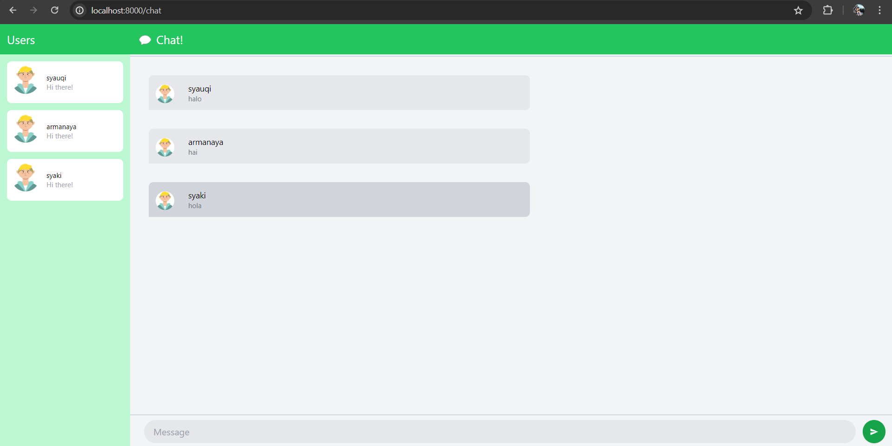

**Syauqi Armanaya Syaki** 
**2206829010** 
**Pemrograman Lanjut C** 

## 3.1. Original code

## 3.2. Add some creativities to the webclient

Di sini saya melakukan perubahan terhadap penggunaan warna dari chat page menjadi bertema hijau dan saya menggunakan avatar yang berbeda dengan melampirkan link ke gambar avatar tersebut. Selain itu saya juga menambahkan efek hover pada beberapa bagian tertentu seperti user, chat, dan tombol untuk mengirim pesan.